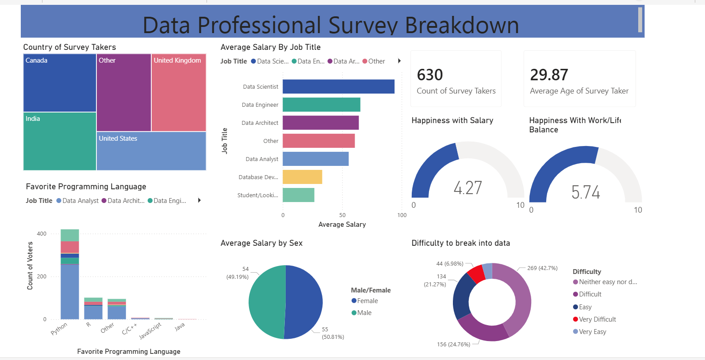

# Data Professional Survey Analysis

## Project Overview
This project provides a comprehensive analysis of the global data professional landscape, utilizing raw survey data from over 630 respondents. The goal was to transform "noisy," unstructured survey responses into a high-fidelity interactive dashboard that reveals trends in compensation, job satisfaction, and industry entry barriers.

---
## Dashboard

---

## Key Features & Visualizations
* **Salary Insights:** Analysis of average salaries by job title (Data Scientist, Data Engineer, etc.) and gender.
* **Tech Stack Trends:** Visualization of the most popular programming languages among data professionals.
* **Sentiment Analysis:** Gauge charts representing "Happiness with Salary" and "Work/Life Balance."
* **Global Reach:** A treemap breakdown of survey participants by country.

---

## Technical Implementation
To meet the requirements of a production-level data product, I focused on the following:

* **Data Cleansing (ETL):** Utilized **Power Query** to standardize inconsistently formatted job titles and country names (e.g., merging "United States," "USA," and "US").
* **Data Modeling:** Engineered a star schema to facilitate dynamic cross-filtering, allowing users to slice metrics by countries, gender, and difficulty to break into the industry.

---

## Tools Used
* **Power BI Desktop:** Report authoring and data modeling.
* **Power Query (M):** Data transformation and standardization.
* **Power BI Service:** Public hosting and distribution.
* **Dataset:** Raw Excel survey data (available in `/dataset` folder).

---

## How to Access
* **Live Dashboard:** https://app.powerbi.com/reportEmbed?reportId=92864413-f15b-4c25-9773-68008be7981f&autoAuth=true&ctid=244e6ed2-339a-47f3-b95c-e45351c198b7
* **NB:** Requires authentication

---

## Key Insights Derived
* **Python Dominance:** Python remains the most preferred language across all data roles, followed by R and SQL.
* **Work-Life Balance:** Despite competitive salaries, the average happiness score for work-life balance sits at **5.74/10**, indicating a significant area for industry improvement.
* **Entry Barriers:** Over **40%** of respondents characterized breaking into the data field as "Difficult" or "Very Difficult."